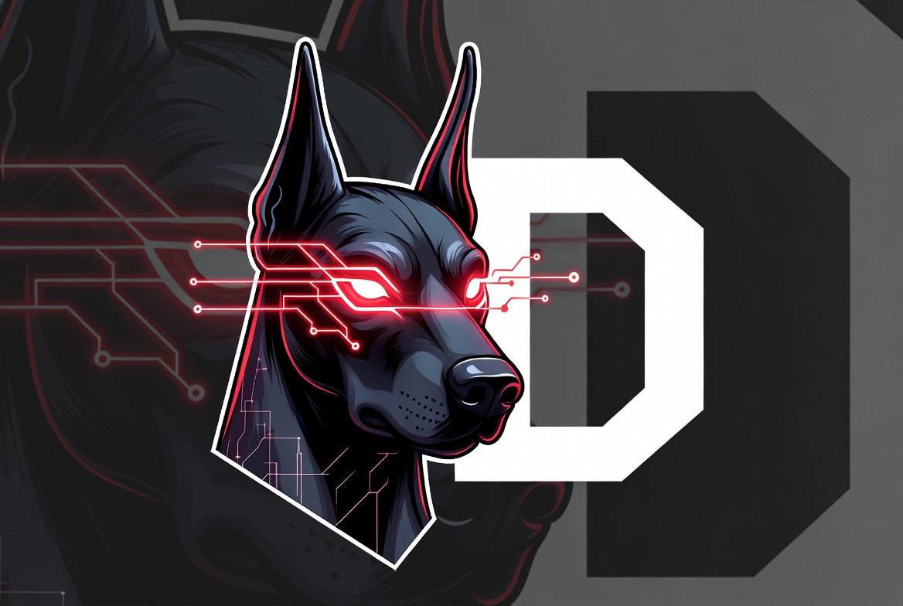

<p align="center">
    
</p>

# Offensive D

D programming language (dlang) weaponisation for offensive security.

The purpose of this project is to do some experiments with [D](https://dlang.org/) (dlang), and to explore the possibility of using it for implant development and general offensive operations. It is inspired by [@byt3bl33d3r](https://twitter.com/byt3bl33d3r)'s project "[OffensiveNim](https://github.com/byt3bl33d3r/OffensiveNim)" and [darkr4y](https://github.com/darkr4y)'s "[OffensiveZig](https://github.com/darkr4y/OffensiveZig)".

## Table of Contents
- [OffensiveD](#offensived)
  - [Table of Contents](#table-of-contents)
  - [Why D?](#why-d)
  - [Try to Learn D in Y minutes](#try-to-learn-d-in-y-minutes)
  - [How to play](#how-to-play)
  - [Cross Compiling](#cross-compiling)
  - [Interfacing with C/C++](#interfacing-with-cc)
  - [Creating Windows DLLs with an exported `DllMain`](#creating-windows-dlls-with-an-exported-dllmain)
  - [Optimizing executables for size](#optimizing-executables-for-size)
  - [Opsec Considerations](#opsec-considerations)
  - [Converting C code to D](#converting-c-code-to-d)
  - [Language Bridges](#language-bridges)
  - [Debugging](#debugging)
  - [Setting up a dev environment](#setting-up-a-dev-environment)
  - [Interesting D libraries](#interesting-d-libraries)
  - [D for implant dev links](#d-for-implant-dev-links)
  - [Comparison of D and Nim](#comparison-of-d-and-nim)
  - [Summary](#summary)
  - [Contributors](#contributors)

## Why D?

- D is rarely used in malware (though groups like Lazarus have started experimenting with it), which can provide a natural OPSEC advantage against signature-based detection and reverse-engineering tooling that focuses on more common languages.
- D compiles to native code with no heavy runtime dependency (GC is optional and can be disabled), producing relatively small static executables.
- D has a clean, modern syntax that feels familiar to C/C++ and C# developers while offering higher-level productivity features.
- Excellent, seamless interop with C (and reasonably good with C++) via `extern(C)` / `extern(C++)` - no heavy FFI boilerplate required.
- Manual memory management is fully supported (`@nogc`, `@system`, custom allocators), while still allowing optional GC when convenient.
- Strong cross-compilation support (especially with LDC + LLVM) to many targets without needing a full separate toolchain in many cases.
- Official package manager [](https://code.dlang.org/) and a mature standard library (Phobos).
- The community is active and approachable; the [D forum](https://forum.dlang.org/), Discord, and IRC channels are good places for help.

## Try to Learn D in Y minutes

If you're eager to learn D quickly, start with the excellent [Learn D in Y Minutes](https://learnxinyminutes.com/docs/d/) guide.  
For deeper material see the official [D Language Specification](https://dlang.org/spec/spec.html), [Tour of D](https://tour.dlang.org/), and the [D Wiki](https://wiki.dlang.org/).

## How to play

**Examples in this project**

| Directory / File              | Description                                      |
|-------------------------------|--------------------------------------------------|
| `ApiHooking`                  | API hooking examples                             |
| `DriverEnumeration`           | Enumerate loaded drivers                         |
| `MemoryScanning`              | Memory scanning techniques                       |
| `ModuleEnumeration`           | Enumerate loaded modules                         |
| `PeImageParsing`              | PE parsing utilities                             |
| `ProcessEnumeration`          | Process enumeration                              |
| `SsnDump`                     | System Service Number (SSN) dumping              |
| `ThreadEnumeration`           | Thread enumeration                               |

I recommend installing a D compiler (DMD for simplicity or LDC for better optimization / cross-compilation) from the official site: https://dlang.org/download.html.  
Many examples rely only on the standard library + Windows headers via `core.sys.windows`.

## Cross Compiling

LDC (LLVM-based) makes cross-compilation relatively straightforward.

Example (Linux → Windows x64):

```bash
ldc2 -mtriple=x86_64-windows-msvc -O source.d
